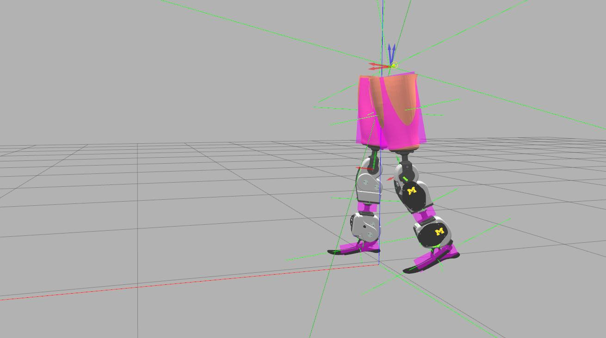

# oslsim

A ROS package for the simulation of Open-source leg (OSL). 

OSL was proposed by the ``Neurobionics Lab at UM`` to unify the research field of prosthetic leg controls. OSL is a robust and relatively inexpensive system that can be easily manufactured, assembled, and controlled. OSL is licensed under a [Creative Commons Attribution 3.0 Unported License](https://creativecommons.org/licenses/by/3.0/deed.en_US).

To know more, visit https://opensourceleg.com/


Developed and tested with ``ROS-Melodic`` and ``Ubuntu 18.04``.

## Getting Started
```
$ git clone https://github.com/homebrew-bionics/oslsim.git
$ cd ../
$ catkin_make
$ source devel/setup.bash
```

## Usage
```
$ roslaunch oslsim main.launch walk:=true
```
*Place your controller logic within the ``oslsim_walker`` node.*


